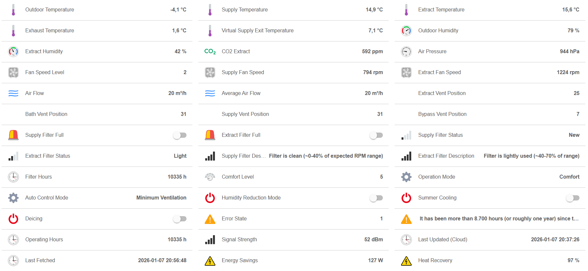

# FreeAir Binding

This binding integrates bluMartin FreeAir ventilation systems with openHAB via the FreeAir Connect cloud service.
It allows monitoring of temperatures, humidity, CO2, air pressure, fan speeds, filter status, and control of ventilation modes.

This is an example of items in a sitemap:



## Prerequisites

### FreeAir Connect Registration

Your freeAir 100 device must be registered at [https://www.freeair-connect.de](https://www.freeair-connect.de) before using this binding.
The serial number and password from your FreeAir Connect account are required to configure the binding.

### Java Cryptography Extension (JCE) Unlimited Strength Policy

**Important:** FreeAir devices with firmware version 2.14 and higher use AES-256 encryption.
Java requires the unlimited strength cryptography policy to be enabled for AES-256 to work.

#### Docker Installation

If running openHAB in Docker, set the environment variable:

```
CRYPTO_POLICY=unlimited
```

Example docker-compose.yml:

```yaml
services:
  openhab:
    image: openhab/openhab:latest
    environment:
      - CRYPTO_POLICY=unlimited
```

#### Manual/Package Installation

For Java 8u161+ and Java 11+, unlimited cryptography is enabled by default.
If you encounter "Illegal key size" errors, edit `$JAVA_HOME/conf/security/java.security` and ensure:

```
crypto.policy=unlimited
```

## Supported Things

- `device`: FreeAir ventilation device connected via FreeAir Connect cloud

Tested with firmware versions:

- 2.9.0 (AES-128 encryption)
- 2.14.0 (AES-256 encryption)
- 2.22.0 (AES-256 encryption)

## Discovery

Auto-discovery is not supported.
Devices must be configured manually using the serial number and password from your FreeAir Connect account.

## Thing Configuration

| Name            | Type    | Description                                  | Default | Required |
|-----------------|---------|----------------------------------------------|---------|----------|
| serialNumber    | text    | Serial number of the FreeAir device          | N/A     | yes      |
| password        | text    | Password for the FreeAir Connect account     | N/A     | yes      |
| refreshInterval | integer | Interval to poll data from the cloud (sec)   | 600     | no       |

## Channels

Channels are organized into groups for easier navigation.

### Temperature Group

| Channel                       | Type               | Description                          |
|-------------------------------|--------------------|--------------------------------------|
| temperature#tempOutdoor       | Number:Temperature | Outdoor air temperature              |
| temperature#tempSupply        | Number:Temperature | Supply air temperature               |
| temperature#tempExtract       | Number:Temperature | Extract air temperature              |
| temperature#tempExhaust       | Number:Temperature | Exhaust air temperature              |
| temperature#tempVirtSupExit   | Number:Temperature | Virtual supply exit temperature      |

### Humidity Group

| Channel                       | Type                 | Description                        |
|-------------------------------|----------------------|------------------------------------|
| humidity#humidityOutdoor      | Number:Dimensionless | Outdoor relative humidity (%)      |
| humidity#humidityExtract      | Number:Dimensionless | Extract air relative humidity (%)  |

### Air Quality Group

| Channel                       | Type             | Description                          |
|-------------------------------|------------------|--------------------------------------|
| airQuality#co2Extract         | Number:Dimensionless | CO2 level in extract air (ppm)   |
| airQuality#airPressure        | Number:Pressure  | Atmospheric pressure (hPa)           |

### Ventilation Group

| Channel                       | Type   | Description                          |
|-------------------------------|--------|--------------------------------------|
| ventilation#fanSpeed          | Number | Fan speed level (0-10)               |
| ventilation#fanSpeedSupply    | Number | Supply fan speed (RPM)               |
| ventilation#fanSpeedExtract   | Number | Extract fan speed (RPM)              |
| ventilation#airFlow           | Number | Current air flow (m³/h)              |
| ventilation#airFlowAvg        | Number | Average air flow (m³/h)              |
| ventilation#ventPosExtract    | Number | Extract vent position (0-31)         |
| ventilation#ventPosBath       | Number | Bathroom vent position (0-31)        |
| ventilation#ventPosSupply     | Number | Supply vent position (0-31)          |
| ventilation#ventPosBypass     | Number | Bypass vent position (0-31)          |

### Filter Group

| Channel                       | Type        | Description                          |
|-------------------------------|-------------|--------------------------------------|
| filter#filterSupplyFull       | Switch      | Supply filter is full (ON/OFF)       |
| filter#filterExtractFull      | Switch      | Extract filter is full (ON/OFF)      |
| filter#filterStatusSupply     | Number      | Supply filter status (0-4 scale)     |
| filter#filterStatusExtract    | Number      | Extract filter status (0-4 scale)    |
| filter#filterHours            | Number:Time | Filter operating hours               |

### Control Group

| Channel                       | Type   | Read/Write | Description                    |
|-------------------------------|--------|------------|--------------------------------|
| control#comfortLevel          | Number | RW         | Comfort level setting (1-5)    |
| control#operationMode         | String | RW         | Operation mode (see below)     |
| control#controlAuto           | String | R          | Current automatic control mode |

**Operation Mode values:**

- `comfort` - Normal comfort mode
- `sleep` - Sleep/quiet mode
- `turbo` - High ventilation mode
- `turbo_cool` - Turbo cooling mode

**Auto Control Mode values (read-only):**

- `min_ventilation` - Minimum ventilation
- `humidity_reduction_rel` - Humidity reduction (relative)
- `humidity_reduction_abs` - Humidity reduction (absolute)
- `active_cooling` - Active cooling
- `co2_reduction` - CO2 reduction
- `water_insertion` - Water insertion
- `outdoor_temp_lt_22_degc` - Outdoor temp < -22°C
- `humidity_input` - Humidity input

### Features Group

| Channel                       | Type   | Description                          |
|-------------------------------|--------|--------------------------------------|
| features#humidityReductionMode| Switch | Humidity reduction mode active       |
| features#summerCooling        | Switch | Summer cooling active                |
| features#deicing              | Switch | Deicing/defrost active               |

### Diagnostics Group

| Channel                       | Type        | Description                          |
|-------------------------------|-------------|--------------------------------------|
| diagnostics#errorState        | Number      | Device error state code              |
| diagnostics#operatingHours    | Number:Time | Total operating hours                |
| diagnostics#rssi              | Number:Power| Wireless signal strength (dBm)       |

### Efficiency Group

| Channel                       | Type                 | Description                    |
|-------------------------------|----------------------|--------------------------------|
| efficiency#energySavings      | Number:Power         | Calculated energy savings (W)  |
| efficiency#heatRecovery       | Number:Dimensionless | Heat recovery efficiency (%)   |

## Full Example

### Thing Configuration

```java
Thing freeair:device:livingroom "FreeAir Living Room" [serialNumber="12345", password="MyPassword", refreshInterval=300]
```

### Item Configuration

```java
// Temperature
Number:Temperature FreeAir_TempOutdoor "Outdoor Temperature [%.1f °C]" {channel="freeair:device:livingroom:temperature#tempOutdoor"}
Number:Temperature FreeAir_TempSupply "Supply Temperature [%.1f °C]" {channel="freeair:device:livingroom:temperature#tempSupply"}
Number:Temperature FreeAir_TempExtract "Extract Temperature [%.1f °C]" {channel="freeair:device:livingroom:temperature#tempExtract"}

// Humidity
Number:Dimensionless FreeAir_HumidityOutdoor "Outdoor Humidity [%.0f %%]" {channel="freeair:device:livingroom:humidity#humidityOutdoor"}
Number:Dimensionless FreeAir_HumidityExtract "Extract Humidity [%.0f %%]" {channel="freeair:device:livingroom:humidity#humidityExtract"}

// Air Quality
Number:Dimensionless FreeAir_CO2 "CO2 Level [%.0f ppm]" {channel="freeair:device:livingroom:airQuality#co2Extract"}
Number:Pressure FreeAir_Pressure "Air Pressure [%.0f hPa]" {channel="freeair:device:livingroom:airQuality#airPressure"}

// Fan
Number FreeAir_FanSpeed "Fan Speed Level [%d]" {channel="freeair:device:livingroom:ventilation#fanSpeed"}
Number FreeAir_FanSupplyRPM "Supply Fan [%.0f rpm]" {channel="freeair:device:livingroom:ventilation#fanSpeedSupply"}
Number FreeAir_FanExtractRPM "Extract Fan [%.0f rpm]" {channel="freeair:device:livingroom:ventilation#fanSpeedExtract"}

// Filter
Switch FreeAir_FilterSupplyFull "Supply Filter Full" {channel="freeair:device:livingroom:filter#filterSupplyFull"}
Switch FreeAir_FilterExtractFull "Extract Filter Full" {channel="freeair:device:livingroom:filter#filterExtractFull"}

// Control
Number FreeAir_ComfortLevel "Comfort Level [%d]" {channel="freeair:device:livingroom:control#comfortLevel"}
String FreeAir_OperationMode "Operation Mode [%s]" {channel="freeair:device:livingroom:control#operationMode"}

// Efficiency
Number:Power FreeAir_EnergySavings "Energy Savings [%.0f W]" {channel="freeair:device:livingroom:efficiency#energySavings"}
Number:Dimensionless FreeAir_HeatRecovery "Heat Recovery [%.0f %%]" {channel="freeair:device:livingroom:efficiency#heatRecovery"}
```

### Sitemap Configuration

```perl
sitemap freeair label="FreeAir Ventilation" {
    Frame label="Temperature" {
        Text item=FreeAir_TempOutdoor
        Text item=FreeAir_TempSupply
        Text item=FreeAir_TempExtract
    }
    Frame label="Humidity & Air Quality" {
        Text item=FreeAir_HumidityOutdoor
        Text item=FreeAir_HumidityExtract
        Text item=FreeAir_CO2
        Text item=FreeAir_Pressure
    }
    Frame label="Ventilation" {
        Text item=FreeAir_FanSpeed
        Text item=FreeAir_FanSupplyRPM
        Text item=FreeAir_FanExtractRPM
    }
    Frame label="Filter Status" {
        Text item=FreeAir_FilterSupplyFull
        Text item=FreeAir_FilterExtractFull
    }
    Frame label="Control" {
        Setpoint item=FreeAir_ComfortLevel minValue=1 maxValue=5 step=1
        Selection item=FreeAir_OperationMode mappings=["comfort"="Comfort", "sleep"="Sleep", "turbo"="Turbo", "turbo_cool"="Turbo Cool"]
    }
    Frame label="Efficiency" {
        Text item=FreeAir_EnergySavings
        Text item=FreeAir_HeatRecovery
    }
}
```


## Troubleshooting

### "Illegal key size" error

This error occurs when Java's cryptography policy restricts key sizes.
FreeAir devices with firmware 2.14+ require AES-256 encryption.

**Solution:** Enable unlimited cryptography policy (see Prerequisites section above).

### Device goes OFFLINE with "Failed to parse device data"

Check the openHAB logs for detailed error messages.
Common causes:

- Incorrect password
- Network connectivity issues to freeair-connect.de
- Encryption key size issue (see above)

### Device shows UNKNOWN status

The binding is attempting to connect.
If it stays in UNKNOWN state, check:

- Serial number is correct
- Password is correct
- Internet connectivity
